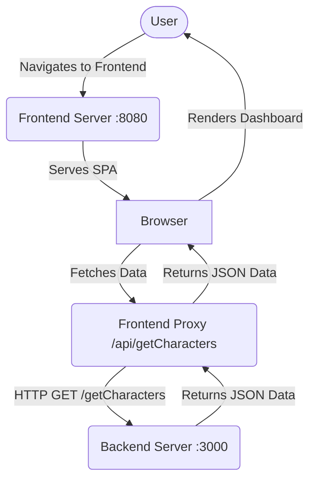

# Memory Peg System - Frontend

A simple, mobile-friendly frontend for the Memory Peg System. Displays information when users visit the `/getCharacters` route.

## Rationale
The application requires an accessible, beautiful, and dynamic frontend to consume the backend API endpoints and present the memory peg characters and day themes to the user.

## Goal
To build a stunning, glassmorphism-styled UI with a dark theme and neon accents that showcases the characters intuitively.

## Main Features
- Fetches data from the local Memory Peg backend API seamlessly
- Proxies requests to avoid CORS overhead
- Beautiful Glassmorphism UI
- Responsive dashboard

## Roadmap Features
- Interactive Learning Stage (Below the main dashboard)
- Search and filtering capabilities
- Mobile App / PWA conversion

## Data Flow Diagram


## Running Locally

1. Make sure the backend server (`Memory-Peg-System`) is running on `http://localhost:3000`
2. Start the frontend server:
```bash
npm install
npm run start
```
3. Open `http://localhost:8080` in your browser.
